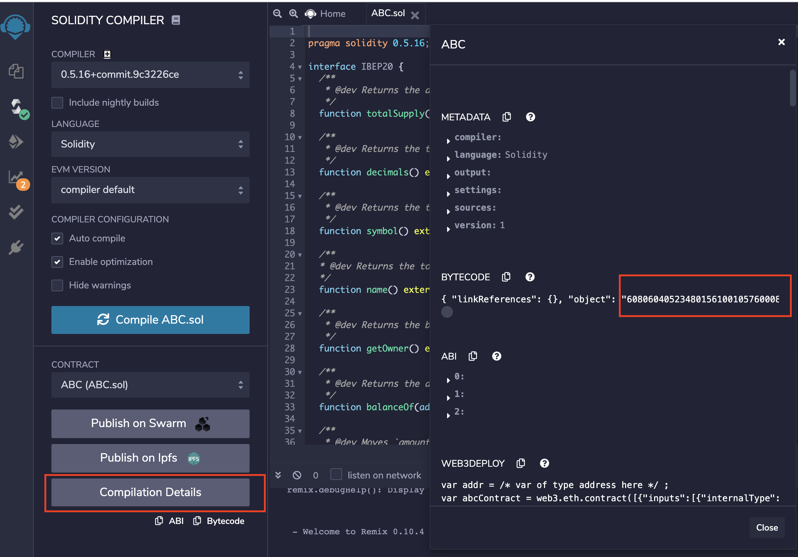

# token-bind-tool
Tool to bind BEP2 tokens and BEP20 tokens

## Compile

Compile token bind tool:
```shell script
make build
```

## Preparation for binding tokens

1. Prepare a MacOS computer.
2. Connect ledger to your computer and open Binance Chain App
3. Import bep2 token owner key:

    3.1 From ledger
    ```shell script
    bnbcli keys add bep2TokenOwner --ledger --index 0
    ```
    3.2 From mnemonic
    ```shell script
    bnbcli keys add bep2TokenOwner --recover
    ```
4. Generate temp account:
    ```shell script
    ./build/token-bind-tool initKey --network-type mainnet
    ```
    Example response:
    ```text
    Temp account: 0xde9Aa1d632b48d881B50528FC524C88474Ec8809, Explorer url: :  https://bscscan.com/address/0xde9Aa1d632b48d881B50528FC524C88474Ec8809
    ```
   
5. Transfer 1 BNB to the temp account.
   
   5.1 Cross chain transfer
   ```shell script
    bnbcli bridge transfer-out --expire-time `expr $(date +%s) + 3600` \
    --chain-id Binance-Chain-Tigris --from {keyName} --node http://dataseed4.binance.org:80 \
    --to {temp account address} --amount 100000000:BNB
    ```
   Example command:
   ```shell script
   bnbcli bridge transfer-out --expire-time `expr $(date +%s) + 3600` \
   --chain-id Binance-Chain-Tigris --from bep2TokenOwner --node http://dataseed4.binance.org:80 \
   --to 0xde9Aa1d632b48d881B50528FC524C88474Ec8809 --amount 200000000:BNB
   ```
   
   5.2 You can also transfer BNB from other Binance Smart Chain account.

6. Prepare BEP20 contract code

    You can refer to [BEP20 Template](https://github.com/binance-chain/bsc-genesis-contract/blob/master/contracts/bep20_template/BEP20Token.template) and modify it according to your own requirements. Compile your contract with [Remix](https://remix.ethereum.org) and get contract byte code:
    
    
7. Edit `script/config.json`

    ```json
    {
      "contract_data": "",
      "bep20_symbol": "",
      "bep2_symbol": "",
      "final_bep20_owner": ""
    }
    ```
    Fill contract byte code to `contract_data`, fill BEP20 contract symbol to `bep20_symbol`, fill BEP2 token symbol to `bep2_symbol` and fill your owner account to `final_bep20_owner`. Once the bind is success, the BEP20 token ownership will be transfer to your owner account.
   
## Bind BEP2 token with BEP20 token


    ```shell script
    ./bind {network type} {bep2TokenOwnerKeyName} {peggyAmount} {bep2 token symbol} {final token owner} {path to bnbcli or tbnbcli}
    ```

    Example command:
    ```shell script
    ./bind.sh mainnet bep2TokenOwner 0 ETH-2C2 0xaa25Aa7a19f9c426E07dee59b12f944f4d9f1DD3 $HOME/go/bin/bnbcli
    ```